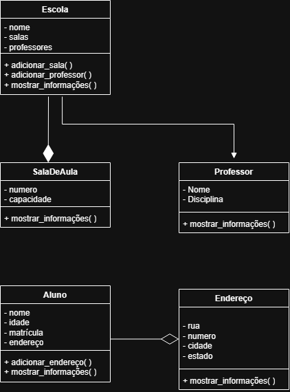

# Sistema de Gerenciamento Escolar

## Objetivo

Implementação de um sistema simples para gerenciamento de uma
escola utilizando Programação Orientada a Objetos em Python.

O projeto trabalha com as classes Escola, SalaDeAula, Professor,
Aluno e Endereço, além dos conceitos de associação, agregação
e composição.

## 1. Classes

### Escola

**Atributos:**
- nome
- salas
- professores

**Métodos:**
- adicionar_sala()
- adicionar_professor()
- mostrar_informações()

### SaladeAula

**Atributos:**
- numero
- capacidade

**Métodos:**
- mostrar_informações()

### Professor

**Atributos:**
- nome
- disciplina

**Métodos:**
- mostrar_informações()

### Aluno

**Atributos:**
- nome
- idade
- matrícula

**Métodos:**
- adicionar_endereço
- mostrar_informações

### Endereço

**Atributos:**
- rua
- numero
- cidade
- estado

**Métodos:**
- mostrar_informações()

## 2. Relacionamentos

### Escola ——◆ SalaDeAula

Tipo: Composição (◆)

Uma escola possui várias salas de aula. As salas dependem da escola para existir no sistema. Se a escola for removida, suas salas também deixam de existir.

### Escola ——— Professor

Tipo: Associação

Um professor pode lecionar em várias escolas e uma escola pode possuir vários professores. Ambos podem existir independentemente.

### Aluno ——◇ Endereço

Tipo: Agregação (◇)

O aluno possui um endereço, mas o endereço pode continuar
existindo mesmo que o aluno seja removido.

## 3. Diagrama UML



## 4. Como executar

É necessário ter o Python 3 instalado.

No terminal, execute:

```bash
python ATT-1/Trabalho-1.py
```

Se estiver usando Windows e o comando `python` não funcionar, normalmente:

```bash
py ATT-1/Trabalho-1.py
```